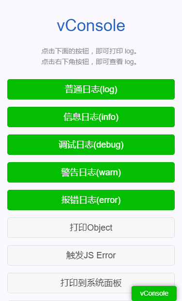
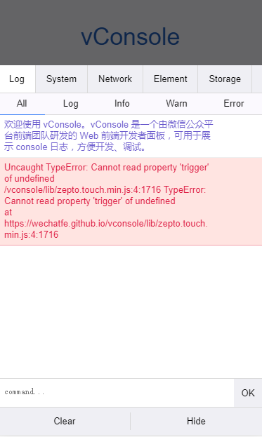

# vConsole移动端真机调试

vConsole可以用于在移动端进行真机调试





## Github地址：
[https://github.com/Tencent/vConsole](https://github.com/Tencent/vConsole)

## 用法

### CDN

```js
<script src="https://cdn.jsdelivr.net/npm/vconsole@3.3.4/dist/vconsole.min.js"></script>
<script>
  var vConsole = new VConsole();
</script>
```

### SPA

npm 安装：

```sh
npm install vconsole
```

全局或者局部引用：

```js
import VConsole from 'vconsole'
new VConsole()
```

## 生产环境中使用

有时候需要在生产环境中使用 vconsole，但是不希望调试窗口对用户可见，在 url 中追加参数，通过参数来控制 vconsole 的显示